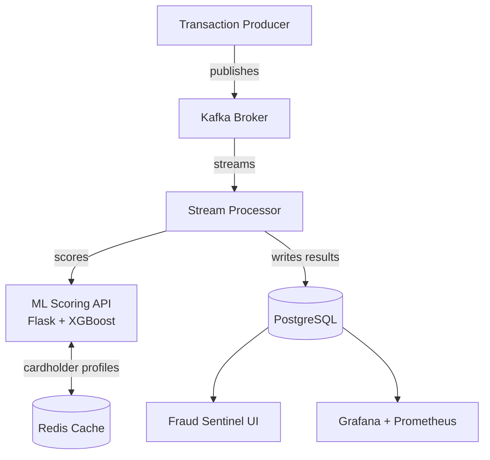

# Realtime Card Fraud Detector

End-to-end fraud detection pipeline that scores financial transactions in real time. Kafka handles the event stream, an XGBoost model flags suspicious activity, PostgreSQL and Redis store results, and a custom live dashboard surfaces fraud as it happens — all running locally via Docker Compose.

## How it works

1. A **producer** generates synthetic card transactions and publishes them to Kafka
2. A **stream processor** consumes each event and calls the ML scoring API
3. The **ML service** enriches the transaction with cardholder history from Redis, runs 17 features through XGBoost, and returns a fraud probability
4. Results are written to **PostgreSQL** and surfaced on two dashboards in real time

## Stack

| | |
|---|---|
| Model | XGBoost — trained on 907K transactions, 17 engineered features |
| Streaming | Kafka + kafka-python |
| Serving | Flask (scoring API) + FastAPI (dashboard backend) |
| Storage | PostgreSQL (predictions) · Redis (cardholder profiles) |
| Monitoring | Prometheus + Grafana |
| Infra | Docker Compose |

## Model results

| Metric | |
|---|---|
| ROC AUC | 0.999 |
| Recall | 0.916 |
| Precision | 0.708 |
| F1 | 0.798 |

Strongest signals: transaction amount, time of day (night flag), merchant category, and deviation from the cardholder's typical spend.

## Architecture



## Screenshots

### Fraud Sentinel


### Grafana


### Logs

| Producer | Processor | ML Scorer |
|---|---|---|
|  |  |  |

## Run it

```bash
git clone https://github.com/<your-username>/Realtime-Card-Fraud-Detector.git
cd Realtime-Card-Fraud-Detector
docker compose up -d --build
```

| | |
|---|---|
| Fraud Sentinel | http://localhost:8050 |
| Grafana | http://localhost:3000 |
| ML API | http://localhost:5001/health |
| Prometheus | http://localhost:9090 |
