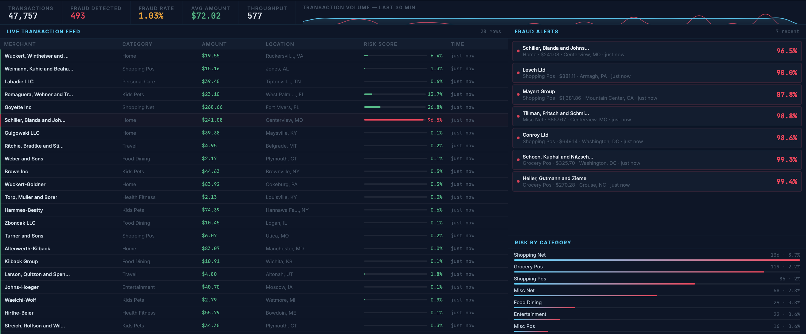
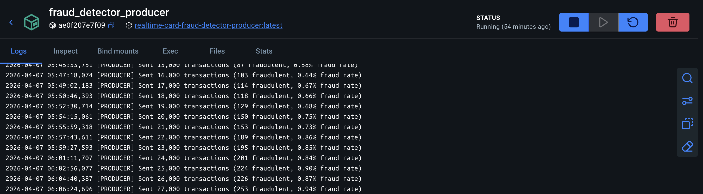
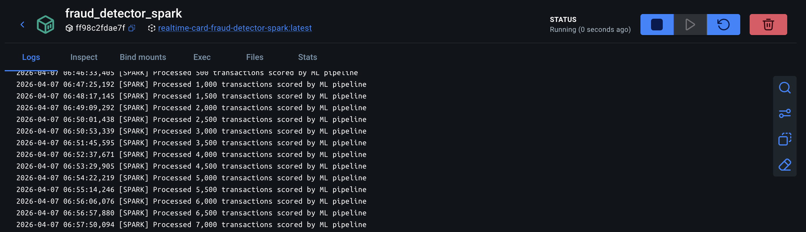
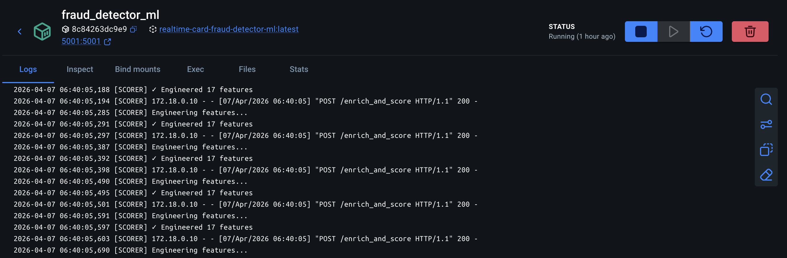

# Realtime Card Fraud Detector

A fully containerized real-time fraud detection system built with Kafka, Spark, XGBoost, Redis, and Docker. The pipeline streams synthetic financial transactions through a machine learning scoring service, stores results in PostgreSQL, and visualizes activity on a live custom dashboard and Grafana — demonstrating a production-like architecture for financial transaction monitoring.

## Features

- **Transaction Producer** — Streams realistic synthetic transactions via Kafka
- **Stream Processor** — Kafka consumer pipeline that routes transactions to the ML service
- **ML Scoring Service** — Serves a trained XGBoost model via Flask for real-time inference
- **Feature Engineering** — 17 behavioral and temporal features (amount ratios, night/weekend flags, geo distance, cardholder history)
- **Redis Cache** — Stores cardholder profiles for fast feature enrichment
- **PostgreSQL** — Persists all scored transactions and fraud alerts
- **Fraud Sentinel** — Custom real-time web dashboard with live transaction feed and alerts
- **Grafana** — Metrics dashboard powered by Prometheus
- **Containerized Deployment** — All components orchestrated via Docker Compose

## Architecture

```
Transaction Producer
       │
       ▼
  Kafka Broker
       │
       ▼
 Stream Processor ──► ML Scoring API (Flask + XGBoost)
       │                      │
       ▼                      ▼
  PostgreSQL ◄──────── Redis (Feature Cache)
       │
       ▼
 Fraud Sentinel UI      Grafana + Prometheus
```

## Tech Stack

| Layer | Technology |
|---|---|
| ML & Data | Python, Pandas, Scikit-learn, XGBoost |
| Streaming | Kafka, kafka-python |
| Model Serving | Flask |
| Storage | PostgreSQL, Redis |
| Dashboard | FastAPI, HTML/CSS/JS, Chart.js |
| Monitoring | Prometheus, Grafana |
| Infrastructure | Docker, Docker Compose |

## Model Performance

Trained on 907,672 transactions with 17 engineered features:

| Metric | Score |
|---|---|
| ROC AUC | 0.999 |
| Recall (fraud) | 0.916 |
| Precision (fraud) | 0.708 |
| F1-score | 0.798 |

Top features by importance: transaction amount, night-time flag, merchant category, hour of day, and amount-to-average ratio.

## Screenshots

### Fraud Sentinel — Live Dashboard


### Grafana — Metrics


### Service Logs

| Producer | Stream Processor | ML Scorer |
|---|---|---|
|  |  |  |

## Getting Started

**Prerequisites:** Docker & Docker Compose, Git

```bash
git clone https://github.com/<your-username>/Realtime-Card-Fraud-Detector.git
cd Realtime-Card-Fraud-Detector
docker compose up -d --build
```

**Services:**

| Service | URL |
|---|---|
| Fraud Sentinel Dashboard | http://localhost:8050 |
| ML Scoring API | http://localhost:5001/health |
| Grafana | http://localhost:3000 |
| Prometheus | http://localhost:9090 |
